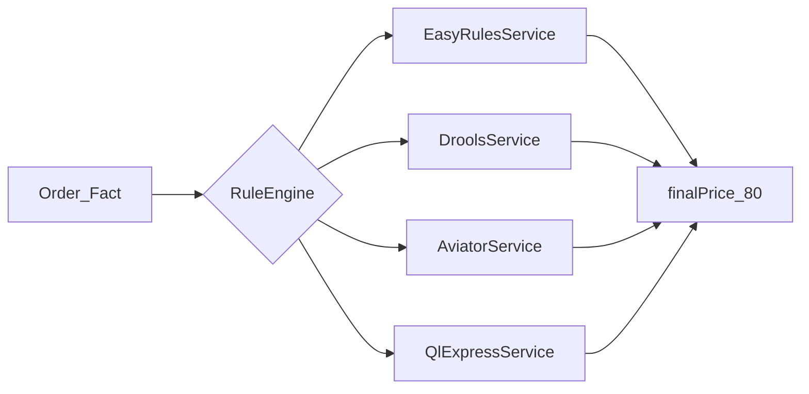

# rule-engine-demo

Spring Boot 3.5 + JDK 17 下，Drools / Easy Rules / Aviator / QLExpress 四款规则引擎的最小可运行对照 Demo。统一业务场景：VIP 客户 8 折（100 → 80）。


本仓库提供四条 VIP 打折规则、4 个 REST GET 端点与单元测试；不展开 Drools 推理链/CEP、规则热更存储与冲突策略。规则外置后，Java 侧只负责传入 Fact（POJO），写法上类似 MyBatis 动态 SQL 将条件移出 Service。

## 项目目标

### 能干嘛？

在同一 `Order` Fact 上，对照四种规则引擎的 Condition（条件）与 Action（动作）写法，观察同一业务规则在不同引擎中的集成方式。

### 有啥用？

- 本地跑通四引擎最小 Spring Boot 集成，无需数据库或中间件
- 通过 REST 与 `./mvnw test` 快速验证规则执行结果
- 对照选型表，判断百条以内稳定规则、公式热更、流程脚本、上千条推理等场景的引擎取舍

## 环境与依赖

| 项 | 说明 |
|----|------|
| JDK | **17**（Spring Boot 3.5 要求；构建时 `JAVA_HOME` 须指向 JDK 17） |
| Maven | 3.6+（可用项目自带 `./mvnw`） |
| Spring Boot | 3.5.15 |
| 配置文件 | [`application.properties`](src/main/resources/application.properties)（默认端口 8080） |
| 构建文件 | [`pom.xml`](pom.xml) |

| 依赖 | 版本 |
|------|------|
| drools-engine | 8.44.2.Final |
| drools-xml-support | 8.44.2.Final |
| drools-mvel | 8.44.2.Final |
| easy-rules-core | 4.1.0 |
| aviator | 5.4.3 |
| QLExpress | 3.3.4 |

> Drools 8 使用经典 DRL 时，需额外引入 `drools-xml-support`（解析 `kmodule.xml`）与 `drools-mvel`（属性约束），已在 [`pom.xml`](pom.xml) 中配置。

## 快速开始

以下命令从**仓库根目录**（含 `pom.xml` 的目录）执行。

```powershell
./mvnw test
./mvnw spring-boot:run
```

另开终端验证 REST：

```powershell
curl http://localhost:8080/demo/easy-rules
curl http://localhost:8080/demo/drools
curl http://localhost:8080/demo/aviator
curl http://localhost:8080/demo/qlexpress
```

期望响应：

```json
{"engine":"easy-rules","originalPrice":100.0,"finalPrice":80.0,"level":"VIP"}
```

## 执行流程



## 模块索引

| 模块 | 路径 | 说明 |
|------|------|------|
| 共享 Fact | [`Order.java`](src/main/java/com/xuan/rule/domain/Order.java) | originalPrice / finalPrice / level |
| Easy Rules 规则 | [`VipDiscountRule.java`](src/main/java/com/xuan/rule/easyrules/VipDiscountRule.java) | `@Condition` + `@Action` 注解 |
| Easy Rules 服务 | [`EasyRulesService.java`](src/main/java/com/xuan/rule/easyrules/EasyRulesService.java) | 注册规则并 fire |
| Drools DRL | [`vip-discount.drl`](src/main/resources/rules/vip-discount.drl) | `level == "VIP"` → 8 折 |
| Drools 配置 | [`kmodule.xml`](src/main/resources/META-INF/kmodule.xml) | ksession 名 `ksession-rules` |
| Drools 服务 | [`DroolsService.java`](src/main/java/com/xuan/rule/drools/DroolsService.java) | insert → fireAllRules |
| Aviator 服务 | [`AviatorService.java`](src/main/java/com/xuan/rule/aviator/AviatorService.java) | 三元表达式字符串 |
| QLExpress 服务 | [`QlExpressService.java`](src/main/java/com/xuan/rule/qlexpress/QlExpressService.java) | if/else 脚本字符串 |
| REST 入口 | [`RuleDemoController.java`](src/main/java/com/xuan/rule/web/RuleDemoController.java) | 4 个 GET `/demo/*` |

### REST 端点

| 路径 | 引擎 | 运行命令 |
|------|------|----------|
| `GET /demo/easy-rules` | Easy Rules | `curl http://localhost:8080/demo/easy-rules` |
| `GET /demo/drools` | Drools | `curl http://localhost:8080/demo/drools` |
| `GET /demo/aviator` | Aviator | `curl http://localhost:8080/demo/aviator` |
| `GET /demo/qlexpress` | QLExpress | `curl http://localhost:8080/demo/qlexpress` |

### 测试类

执行 `./mvnw test` 覆盖以下用例：

| 测试类 | 断言 |
|--------|------|
| [`EasyRulesServiceTest`](src/test/java/com/xuan/rule/easyrules/EasyRulesServiceTest.java) | VIP → 80.0，NORMAL → 100.0 |
| [`DroolsServiceTest`](src/test/java/com/xuan/rule/drools/DroolsServiceTest.java) | 同上 |
| [`AviatorServiceTest`](src/test/java/com/xuan/rule/aviator/AviatorServiceTest.java) | 同上 |
| [`QlExpressServiceTest`](src/test/java/com/xuan/rule/qlexpress/QlExpressServiceTest.java) | 同上 |
| [`RuleDemoControllerTest`](src/test/java/com/xuan/rule/web/RuleDemoControllerTest.java) | 4 端点返回 200 且 JSON 字段正确 |

## 核心知识点

### 规则三要素

| 要素 | 含义 | 本 Demo 对应 |
|------|------|-------------|
| Fact | 传入引擎的业务对象 | `Order` |
| Condition / LHS | 触发条件 | `level == "VIP"` |
| Action / RHS | 执行动作 | `finalPrice = originalPrice * 0.8` |

### 四引擎选型对照

| 维度 | Drools | Easy Rules | Aviator | QLExpress |
|------|--------|------------|---------|-----------|
| 核心机制 | Rete 网络 | 遍历注册规则 | 表达式编译为字节码 | 脚本解释执行 |
| 学习成本 | 高（DRL + API） | 低（Java 注解） | 低（类 Java 表达式） | 中（类 JS/Java 脚本） |
| 规则量级 | 上千条显 Rete 优势 | 百条以内够用 | 公式型、偏计算 | 千级脚本、偏流程 |
| 动态热更 | 可，常配 Workbench | 需重新注册规则对象 | 表达式字符串存 DB | 脚本存 DB |
| 典型场景 | 风控 / 推理链 | 简单营销 / 权限 | 动态定价 / 佣金 | 满减 / 运费脚本 |

### 各引擎最小写法（节选）

完整实现见模块索引中的源文件。

**Easy Rules** — [`VipDiscountRule.java`](src/main/java/com/xuan/rule/easyrules/VipDiscountRule.java)

```java
@Condition
public boolean isVip(@Fact("order") Order order) {
    return "VIP".equals(order.getLevel());
}
@Action
public void applyDiscount(@Fact("order") Order order) {
    order.setFinalPrice(order.getOriginalPrice() * 0.8);
}
```

**Drools** — [`vip-discount.drl`](src/main/resources/rules/vip-discount.drl)

```java
rule "VIP_Discount"
when
    $order : Order(level == "VIP")
then
    $order.setFinalPrice($order.getOriginalPrice() * 0.8);
end
```

**Aviator** — [`AviatorService.java`](src/main/java/com/xuan/rule/aviator/AviatorService.java)

```java
String expr = "level == 'VIP' ? originalPrice * 0.8 : originalPrice";
AviatorEvaluator.execute(expr, Map.of("originalPrice", 100.0, "level", "VIP"));
```

**QLExpress** — [`QlExpressService.java`](src/main/java/com/xuan/rule/qlexpress/QlExpressService.java)

```java
String script = "if (level == 'VIP') { return originalPrice * 0.8; } else { return originalPrice; }";
runner.execute(script, context, null, true, false);
```

## 官方文档

| 资源 | 链接 |
|------|------|
| Drools Documentation | https://docs.drools.org/latest/drools-docs/drools/index.html |
| Easy Rules Wiki | https://github.com/j-easy/easy-rules/wiki |
| AviatorScript | https://github.com/killme2008/aviatorscript |
| QLExpress | https://github.com/alibaba/QLExpress |
